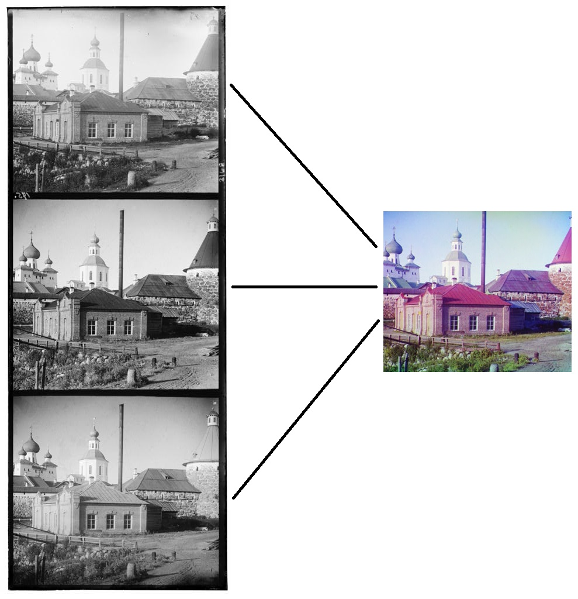
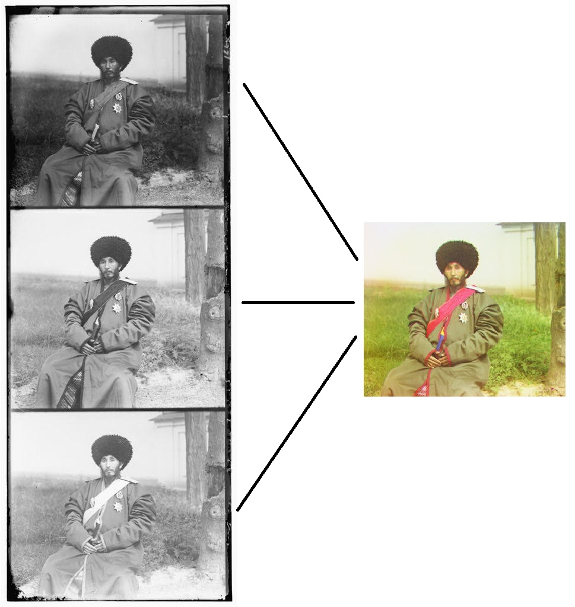
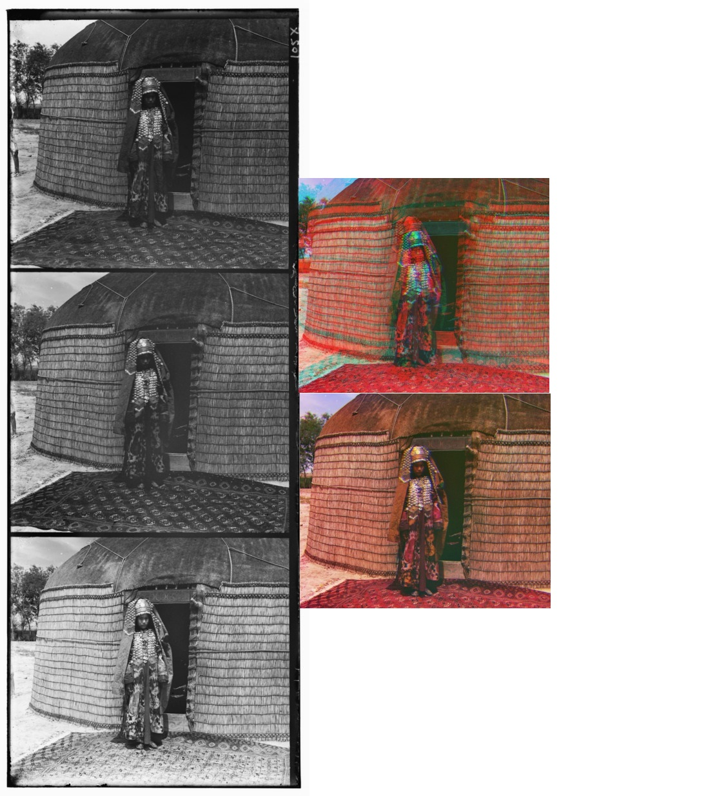

# Colorizing Prokudin Gorskii Images

Sergei Mikhailovich Prokudin-Gorskii (1863-1944) [[1]] a Russian chemist and photographer, is 
considered as a Pioneer of color photography. Convinced, as early as 1907, that color photography was 
the wave of the future, with Tzar's special permission, he traveled across the Russian Empire and took
color photographs of people, buildings, landscapes, railroads, bridges... thousands of color pictures! 
His idea was simple: record three exposures of every scene onto a glass plate using a red, a green, and 
a blue filter. He even envisioned special projectors to be installed in "multimedia" classrooms all across 
Russia where the children would be able to learn about their country. These negative plates is now in 
possession by the Library of Congress of U.S.A., and have been recently digitized. They are available on-line at 
[[2]]

[1]: http://en.wikipedia.org/wiki/Prokudin-Gorskii
[2]: http://www.loc.gov/exhibits/empire/gorskii.html

# Purpose

This project produces a color image with negative images.

## The Steps

- Split the image into three color channel images.
- Ignore the image borders.
- Apply sobel edge detection to the RGB images.
- Find out displacement vectors by using exhaustive search. (Minimize SSD)
- Align three color channel images to each other.

If I don't use edge detection for alignment, the aligned images look awful. Here is an example of them:

No edge detection used on the top. Used edge detection on the bottom. 

## Requirements
| Env/Libs      | Version       |
| ------------- |:-------------:|
| Python        | 3.8.3         |
| OpenCV        | 4.0.1         |
| Numpy         | 1.17.4        |
| glob2         | 0.7           |
| Matplotlib    | 3.3.2         |
